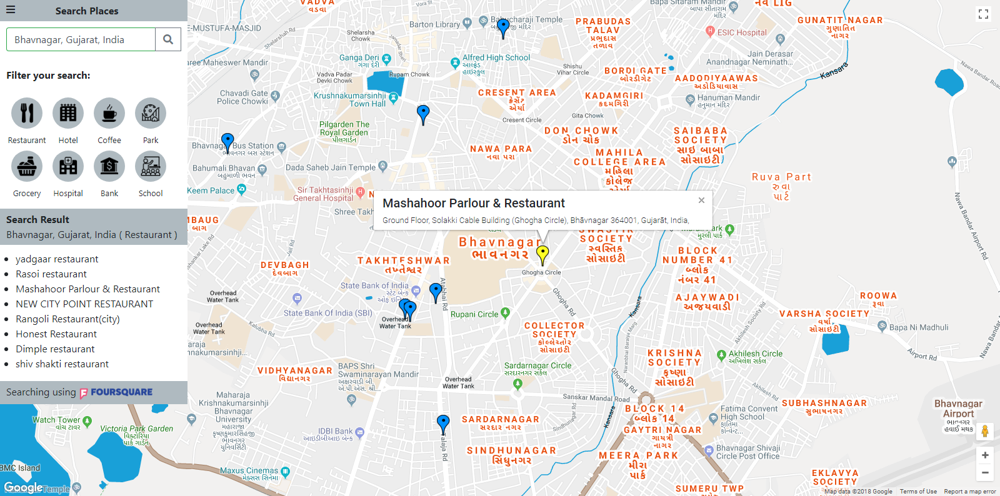

# Neighborhood Map Project

This project is a part of [Full Stack Web Developer Nanodegree Program](https://in.udacity.com/course/full-stack-web-developer-nanodegree--nd004). This is a single page application featuring a map of the user's neighborhood or a neighborhood the user would like to visit.

## Table of contents

* [Objective of project](#objective-of-project)
* [Frameworks, APIs and Libraries](#frameworks,-apis-and-libraries)
* [Helpful Resources](#helpful-resources)
* [Download and setup project](#download-and-setup-project)
* [Demo of project](#demo-of-project)

## Objective of project

This neighborhood map includes the list of locations with detailed information from third-party data. This project also gives the facility to filter location search.

## Frameworks, APIs and Libraries

* [Knockout (Javascript framework)](http://knockoutjs.com/)
* [Bootstrap (CSS framework)](https://getbootstrap.com/)
* [Google Maps APIs](https://cloud.google.com/maps-platform/)
* [Foursquare Developer](https://developer.foursquare.com/)
* [Font Awesome](https://fontawesome.com/)
* [Icons8](https://icons8.com/)

## Helpful Resources

* [https://www.w3schools.com/bootstrap4/](https://www.w3schools.com/bootstrap4/)
* [https://developers.google.com/maps/documentation/javascript/tutorial](https://developers.google.com/maps/documentation/javascript/tutorial)
* [http://knockoutjs.com/documentation/click-binding.html](http://knockoutjs.com/documentation/click-binding.html)
* [https://developer.foursquare.com/docs/api/venues/search](https://developer.foursquare.com/docs/api/venues/search)

## Download and setup project

Download the zip file of the project to your computer or user can clone the repository. [View project](https://github.com/bhumilakum/neighborhood-map)

## Demo of project

